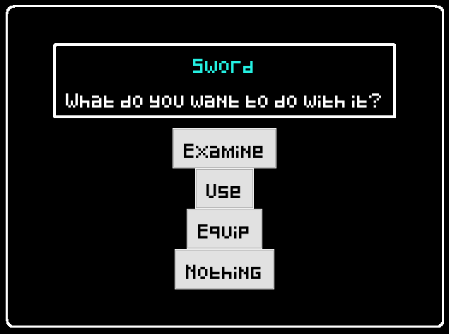
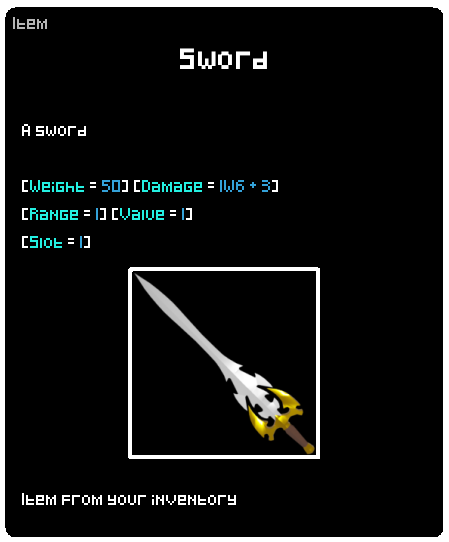
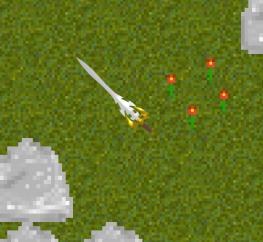

# Items
___

Item Types define the items you can later put in inventories and use on battle maps. You don't need to add an item type multiple times, since the item types are merely a preset and all items you distribute from this item type will access the data from the item type.  
  

## Items in inventories
You can add an item to an inventory via the inventory editor. If you add an item to the player inventory, it will then appear in the player stats frame where the player can view and use it. If the player clicks on an item, he will see the following:  
  
If he clicks on `Examine`, a new frame will open showing all of the item data:  
  
If he clicks on `Use`, the `use` event of the item is executed, which can be used, for example, for consumables.  
If he clicks on `Equip`, the item will be equipped into one of three possible slots. Which slot depends on the `hands` variable: If it has the value `1`, it is put into the main hand (if there is no item there, otherwise in the offhand if this one is free). If it has the value `2` it will be put into both hands (if both are free) and if it has the value `armor`, it will be worn as armor giving the player the amount of protection that the `armor` variable defines.  
‏‏‎ ‎  
If you set the `color` variable, the item name will be colored with this hex value in the inventory (`color` = `daf542`):  
  

## Variables
The items can have a couple of variables:

Variable       | Description                                                                   |
---------------|-------------------------------------------------------------------------------|
armor          | Reduces the amount of damage taken when equipped as armor item                |
color          | `hex` color value that determines the color of the item name in the inventory |
weight         | How much the item adds to the inventory weight                                |
damage         | How much damage the item deals (see below for more infos)                     |
range          | The range of the item on the battle map                                       |
value          | How much the item is worth (unused)                                           |
hands          | Can be either `1`, `2` or `armor` and describes the slots the item takes      |

The damage string can be built this way:  

 * every roll is expressed like this: `[AMOUNT OF ROLLS]W[DICE SIDES]`  
   Examples: `1W6`, `3W20`
 * combining rolls and values: `[ROLL/VALUE] [+;-;*;/] [ROLL/VALUE]`

A few examples:  
`2W6 - 3` `1W20 + 3 - 1W6` `1W6 * 2`

## Tags
The item can have the following tag:

Tag name            | Description                                                                                                        |
--------------------|--------------------------------------------------------------------------------------------------------------------|
viewCanBeObstructed | Removes check if there is an obstacle between you and the enemy on battleMaps (item can be used through obstacles) |

## Items on battle maps
You can add items onto battle maps:  
  
Every time the player or an NPC walk over an item, the `walkOnItem` event of the battle map is triggered. Enemies will not change their behaviour based on items on the ground.
‏‏‎ ‎  
